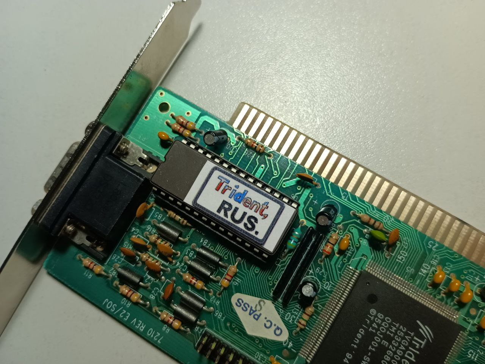
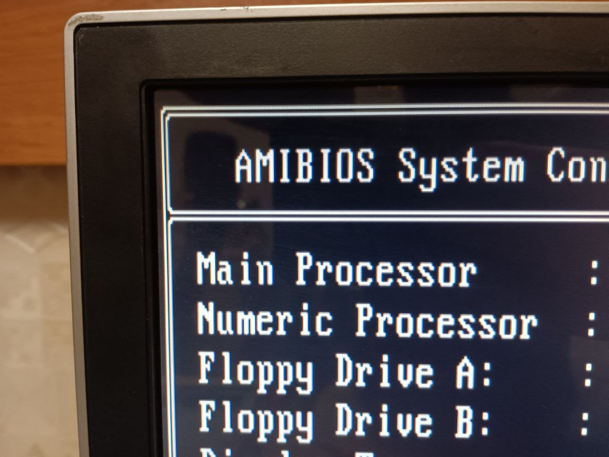
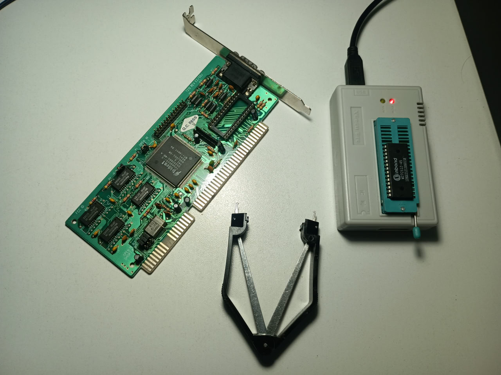
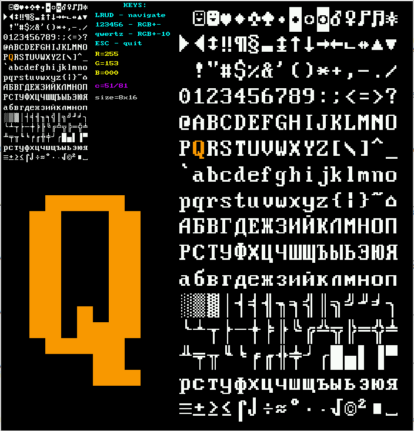

# VGA/EGA Card Font Replacement Toolkit


*Read this in other languages: [Русский](README_rus.md)*



## Contents
- [VGA/EGA Card Font Replacement Toolkit](#vgaega-card-font-replacement-toolkit)
- [Why Do You Need This?](#why-do-you-need-this)
- [Where to Get Fonts?](#where-to-get-fonts)
- [Program Descriptions](#program-descriptions)
  - [fontupdate](#fontupdate)
  - [encode](#encode)
  - [addchecksum](#addchecksum)
- [Requirements](#requirements)
- [Building](#building)
- [Compatibility](#compatibility)
- [Troubleshooting](#troubleshooting)
- [License](#license)

## Why Do You Need This?

You might not always like the default fonts on your video card, or you may want your video card to support different character sets (like Cyrillic) by default. This can be useful to save memory that would otherwise be used by keyboard drivers and TSR programs. Below is an example of a loaded font with smooth box-drawing characters.



For this modification, you'll need a programmer device to read the video card ROM and another ROM chip (like 27C256) to flash the modified image.



## Where to Get Fonts?

There are many DOS font collections available online. For example, the rkega font:



## Program Descriptions

### fontupdate

This program automatically updates fonts by searching for specific signatures (8x8, 8x14, and 8x16 fonts) and updates them based on the provided font files. It automatically calculates the checksum, and the output file is ready for flashing to ROM.

```bash
./fontupdate 
Error: Input ROM file is required
Usage: fontupdate [OPTIONS]
Update fonts in VGA BIOS ROM files.

Options:
  -i, --input <file>  Input ROM file (required)
  -8, --f8 <file>     8x8 font file
  -4, --f14 <file>    8x14 font file
  -6, --f16 <file>    8x16 font file
  -o, --output <file> Output ROM file (default: upd.rom)
  -h, --help          Display this help message

If any font file is not specified, that font will not be replaced.
```

Example usage:

``` bash

./fontupdate -i tvga9000i-D4.01E.bin -8 rkega-8x8.fnt -4 rkega-8x14.fnt -6 rkega-8x16.fnt -o tvga9000i-D4.01E_RUS.bin

```

Where:

* **tvga9000i-D4.01E.bin** - ROM image read from the programmer
* **rkega-\*x\*.fnt** - font files to be flashed
* **tvga9000i-D4.01E_RUS.bin** - modified ROM image ready for flashing

If the program is compiled with debug parameters (make debug), it will also output two additional files:

* **normalize.dat** - ROM image after byte sequence normalization
* **fnt_updated.dat** - ROM image with updated fonts, before byte reordering (not ready for flashing)

These files can be useful to examine with a hex editor for troubleshooting or manual modifications.

### encode 

For historical reasons, bytes in video card ROMs are arranged in a specific way: the even bytes (0, 2, 4, etc.) are at addresses starting from 0x0000, while odd bytes (1, 3, 5, etc.) are at addresses starting from 0x4000. This program helps convert between this format and a sequential format.
Byte layout in ROM:

```
Address:  0x0000  0x0001  0x0002  ...  0x4000  0x4001  0x4002  ...
Data:     byte 0  byte 2  byte 4  ...  byte 1  byte 3  byte 5  ...
```

After normalization:

```
Address:  0x0000  0x0001  0x0002  0x0003  0x0004  0x0005  ...
Data:     byte 0  byte 1  byte 2  byte 3  byte 4  byte 5  ...

```
Example of use:

``` bash

Encode - utility for working with ISA VGA card ROM BIOS

Usage:
  encode [options] <file>

Options:
  -n <file>      Normalization (from ROM format to sequential)
  -m <file>      Mixing (from sequential to ROM format)
  -o <file>      Output filename (default "out.bin")
  -h             Show this help

Examples:
  ./encode -n read_ROM_hard.bin -o norm.bin
  ./encode -m norm.bin -o font_to_rom.bin
```

* Option -n converts from ROM format to a readable sequential format.
* Option -m converts from sequential format to ROM format for flashing.

### addchecksum

Calculates the checksum and adds it to the end of the file. It uses the standard algorithm for summing all bytes in the image, where the final sum should equal 0.

``` bash
Usage: ./addchecksum <rom_file>
```

## Requirements

To compile and use these programs, you'll need:

* GCC (GNU Compiler Collection)
* Make
* ROM programmer for reading/writing ROM chips
* Hex editor (optional, for manual work with files)

## Building

Build the project with a simple command:

``` bash
make
```

If you need more debug information, build with:

``` bash
make debug
```

To clean compiled files from the project:

``` bash
make clean
```

## Compatibility

These programs have been tested with the following video cards:

* Trident TVGA9000i
* Cirrus Logic GD5422

If you have successfully used this toolkit with other models, please create an issue or pull request with the information.


## Troubleshooting
### Problem: Fonts don't display after flashing
#### Possible causes:

* Incorrectly identified font addresses in the ROM
* Incorrect font file format

#### Solution:
Check the format of your font files (they should be binary without headers). Try manually finding font signatures in the ROM image using a hex editor and specify their locations.

### Problem: Checksum error
#### Possible causes:

* Corrupted ROM file
* Incorrect file size

#### Solution:
Make sure the ROM size matches the expected size (typically 32KB or 64KB). Run addchecksum on the file before flashing.

### Problem: Program can't find fonts
#### Possible causes:

* Non-standard BIOS on the video card
* Modified font signatures

#### Solution:
Compile the program in debug mode (make debug) and check the normalize.dat file in a hex editor to manually locate the fonts.

## License

This project is distributed under the MIT License. This license allows use, copying, modification, and distribution of the code for any purpose, including commercial use, provided that the copyright notice and disclaimer are preserved. Full license text:
```
MIT License

Copyright (c) 2025 [Sergei Dolin]

Permission is hereby granted, free of charge, to any person obtaining a copy
of this software and associated documentation files (the "Software"), to deal
in the Software without restriction, including without limitation the rights
to use, copy, modify, merge, publish, distribute, sublicense, and/or sell
copies of the Software, and to permit persons to whom the Software is
furnished to do so, subject to the following conditions:

The above copyright notice and this permission notice shall be included in all
copies or substantial portions of the Software.

THE SOFTWARE IS PROVIDED "AS IS", WITHOUT WARRANTY OF ANY KIND, EXPRESS OR
IMPLIED, INCLUDING BUT NOT LIMITED TO THE WARRANTIES OF MERCHANTABILITY,
FITNESS FOR A PARTICULAR PURPOSE AND NONINFRINGEMENT. IN NO EVENT SHALL THE
AUTHORS OR COPYRIGHT HOLDERS BE LIABLE FOR ANY CLAIM, DAMAGES OR OTHER
LIABILITY, WHETHER IN AN ACTION OF CONTRACT, TORT OR OTHERWISE, ARISING FROM,
OUT OF OR IN CONNECTION WITH THE SOFTWARE OR THE USE OR OTHER DEALINGS IN THE
SOFTWARE.
```
