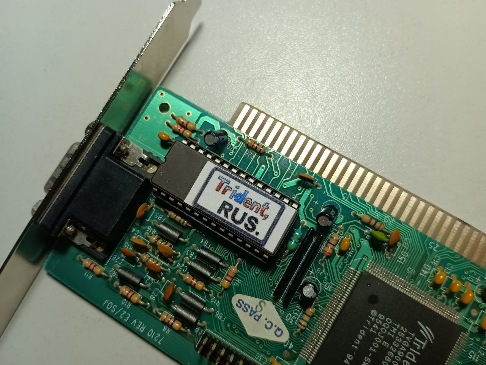
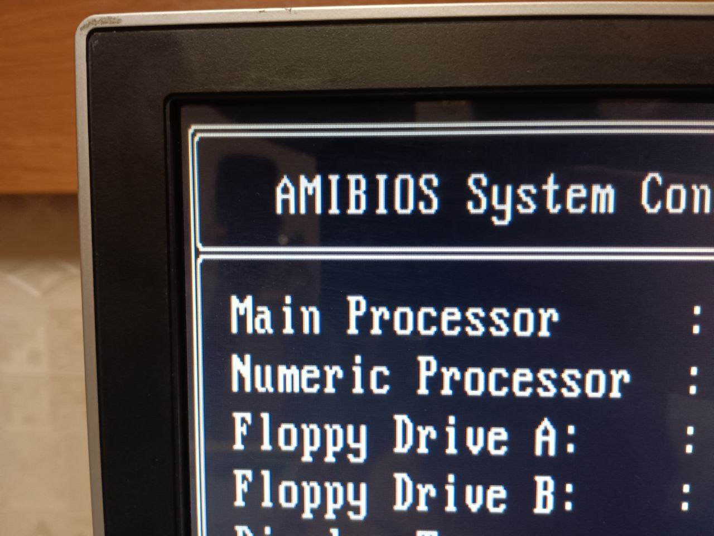
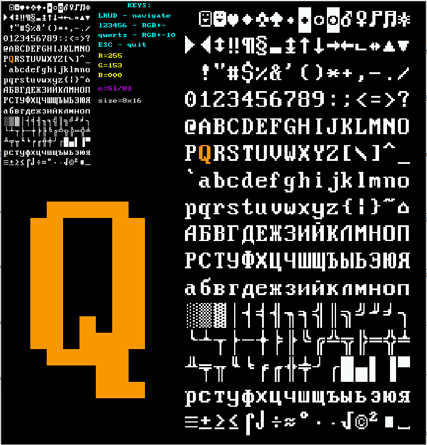

# Набор ПО для замены шрифтов видеокарты (EGA/VGA)




## Содержание
- [Набор ПО для замены шрифтов видеокарты (EGA/VGA)](#набор-по-для-замены-шрифтов-видеокарты-egavga)
- [Для чего это нужно?](#для-чего-это-нужно)
- [Где брать шрифты?](#где-брать-шрифты)
- [Описание программ](#описание-программ)
  - [fontupdate](#fontupdate)
  - [encode](#encode)
  - [addchecksum](#addchecksum)
  - [dos_font_viewer](#dos_font_viewer)
  - [pattern_replace](#pattern_replace)
- [Требования](#требования)
- [Сборка](#сборка)
- [Совместимость](#совместимость)
- [Устранение неполадок](#устранение-неполадок)
- [Лицензия](#лицензия)

## Для чего это нужно?
Не всегда нравятся шрифты видеокарты, либо хочется сделать так, чтобы видеокарта по умолчанию поддерживала русские шрифты. Это бывает полезно, чтобы русификатор клавиатуры не занимал место в памяти. Ниже пример загруженного шрифта со сглаженными рамками.



Для модификации вам понадобится программатор, чтобы прочитать ПЗУ видеокарты и другое ПЗУ, куда можно будет залить готовый образ (например, 27С256).


## Где брать шрифты?

Есть хороший [набор шрифтов DOS](http://old-dos.ru/index.php?page=files&mode=files&do=show&id=6039). Например, шрифт rkega:



## Описание программ

### fontupdate

Служит для автоматического обновления шрифтов по заданной сигнатуре (ищет шрифты 8х8, 8х14, 8х16) и обновляет их в зависимости от приложенного файла. Автоматически рассчитывает контрольную сумму, выходной файл годится для прошивки ПЗУ.

```bash
./fontupdate 
Error: Input ROM file is required
Usage: fontupdate [OPTIONS]
Update fonts in VGA BIOS ROM files.

Options:
  -i, --input <file>  Input ROM file (required)
  -8, --f8 <file>     8x8 font file
  -4, --f14 <file>    8x14 font file
  -6, --f16 <file>    8x16 font file
  -o, --output <file> Output ROM file (default: upd.rom)
  -h, --help          Display this help message

If any font file is not specified, that font will not be replaced.
```

#### Пример использования:

``` bash

./fontupdate -i tvga9000i-D4.01E.bin -8 rkega-8x8.fnt -4 rkega-8x14.fnt -6 rkega-8x16.fnt -o tvga9000i-D4.01E_RUS.bin

```

где:

* **tvga9000i-D4.01E.bin** - образ ПЗУ снятый программатором
* **rkega-\*x\*.fnt** - файлы шрифтов на прошивку
* **tvga9000i-D4.01E_RUS.bin** - русифицированный образ готовый к прошивке

Если программа собрана с отладочными параметрами, то ещё на выходе будет два файла:

* **normalize.dat** - прошивка после нормализации последовательности байт (считанная с ПЗУ)
* **fnt_updated.dat** - прошивка с обновлёнными  шрифтами, до перестановки последовательности байт (не готова к прошивке)

Бывает полезно посмотреть hex-редактором для понимания проблем или ручных доработок.

### encode 

По историческим причинам сложилось, что байты в ПЗУ видеокарты идут следующим образом: нулевой байт идёт по нулевому адресу, первый байт (нечётный) по адресу 0x4000, второй байт по адресу 0x0001, третий по адресу 0x4001. Работать с таким образом неудобно, поэтому служит программа перекодировщик.
Схема расположения байт в ПЗУ:

```
Адрес:   0x0000  0x0001  0x0002  ...  0x4000  0x4001  0x4002  ...
Данные:  байт 0  байт 2  байт 4  ...  байт 1  байт 3  байт 5  ...
```

После нормализации:

```
Адрес:   0x0000  0x0001  0x0002  0x0003  0x0004  0x0005  ...
Данные:  байт 0  байт 1  байт 2  байт 3  байт 4  байт 5  ...

```

#### Пример использования:


``` bash

Encode - utility for working with ISA VGA card ROM BIOS

Usage:
  encode [options] <file>

Options:
  -n <file>      Normalization (from ROM format to sequential)
  -m <file>      Mixing (from sequential to ROM format)
  -o <file>      Output filename (default "out.bin")
  -h             Show this help

Examples:
  ./encode -n read_ROM_hard.bin -o norm.bin
  ./encode -m norm.bin -o font_to_rom.bin
```

* Опция -n перевод в читаемый формат.
* Опция -m перевод в формат для записи в ПЗУ.

### addchecksum

Рассчитывает контрольную сумму и добавляет в конце вложенного файла байт контрольной суммы. Использует стандартный алгоритм суммирования всех байтов образа, при котором итоговая сумма должна быть равна 0.

``` bash
Usage: ./addchecksum <rom_file>
```
### dos_font_viewer
Модуль для просмотра и экспорта отдельных символов DOS-шрифтов в консоли Linux.

#### Возможности

- Визуализация символов DOS-шрифтов (8×16) в консоли с использованием Unicode-блоков
- Экспорт символов в различных форматах:
  - ASCII-арт (текстовый формат)
  - Бинарные данные (исходный формат шрифта)
  - C-массив (готовый для включения в исходный код)
- Поддержка всех 256 символов стандартной DOS-таблицы

#### Использование

```bash
# Просмотр символа с кодом 65 (буква 'A')
./dos_font_viewer /путь/к/файлу_шрифта 65

# Сохранение символа в текстовый файл (ASCII-арт)
./dos_font_viewer /путь/к/файлу_шрифта 65 save txt

# Сохранение символа в бинарном формате
./dos_font_viewer /путь/к/файлу_шрифта 65 save bin

# Сохранение символа в виде C-массива
./dos_font_viewer /путь/к/файлу_шрифта 65 save c
```
#### Форматы экспорта

- _txt_ (по умолчанию) — ASCII-арт, использующий # для заполненных пикселей и . для пустых
- _bin_ — 16 байт данных символа в оригинальном бинарном формате
- _c_ — C-массив с комментариями, готовый для включения в исходный код

#### Пример вывода

Символ с кодом 65 (буква 'A') выглядит так:

```
Символ: 65 (0x41)
        
        
   ██   
  █  █  
 █    █ 
 █    █ 
 ██████ 
 █    █ 
 █    █ 
 █    █ 
 █    █ 
        
        
        
        
        
```

### pattern_replace

Binary Pattern Replace - это консольная утилита, которая ищет бинарные шаблоны в файлах и заменяет их другими шаблонами. Инструмент может как изменять файлы на месте, так и создавать новый выходной файл с заменами.

#### Использование

``` bash
./pattern_replace исходный.bin шаблон_поиска.bin шаблон_замены.bin [выходной.bin]
```
#### Параметры:

* исходный.bin - Исходный бинарный файл, в котором будет выполняться операция поиска и замены
* шаблон_поиска.bin - Бинарный файл, содержащий шаблон для поиска
* шаблон_замены.bin - Бинарный файл, содержащий шаблон для замены
* выходной.bin - (Опционально) Выходной файл, куда будет записан результат

#### Режимы работы:

1.Замена на месте (3 аргумента):

``` bash
./pattern_replace исходный.bin шаблон_поиска.bin шаблон_замены.bin
```
Исходный файл будет изменен напрямую.

2. Вывод в новый файл (4 аргумента):

``` bash
./pattern_replace исходный.bin шаблон_поиска.bin шаблон_замены.bin выходной.bin
```

Исходный файл остается без изменений, а результат записывается в выходной файл.

#### Примеры

Замена всех вхождений определенной последовательности байтов в бинарном файле:

``` bash
./pattern_replace firmware.bin old_signature.bin new_signature.bin
```

Поиск шаблона в файле и запись результата в новый файл:

``` bash
./pattern_replace original.dat pattern.bin replacement.bin modified.dat
```

#### Примечания

- Шаблон замены может иметь размер, отличный от шаблона поиска, что изменит размер выходного файла.
- Утилита сообщает о количестве замененных шаблонов по завершении работы.
- Если шаблон поиска не найден, выходной файл будет идентичен исходному файлу.

## Требования

Для компиляции и использования программ вам понадобится:

* GCC (GNU Compiler Collection)
* Make
* Программатор для чтения/записи ПЗУ
* Hex-редактор (опционально, для ручной работы с файлами)

## Сборка

Собирается просто командой:

``` bash
make
```

Если нужно больше отладочных файлов, то можно собрать с отладочной информацией

``` bash
make debug
```

Для очистки проекта от скомпилированных файлов:

``` bash
make clean
```

## Совместимость

Программы тестировались на следующих видеокартах:

* Trident TVGA9000i
* Cirrus Logic GD5422

Если у вас есть успешный опыт использования с другими моделями, пожалуйста, создайте issue или pull request с информацией.

## Устранение неполадок
### Проблема: Шрифты не отображаются после прошивки
#### Возможные причины:

* Неверно определены адреса шрифтов в ROM
* Неправильный формат файлов шрифтов

#### Решение:
Проверьте формат файлов шрифтов (должен быть двоичный без заголовков). Попробуйте вручную найти сигнатуры шрифтов в образе ROM с помощью hex-редактора и указать их расположение.

### Проблема: Ошибка контрольной суммы
#### Возможные причины:

* Повреждение файла ROM
* Неправильный размер файла

#### Решение:
Убедитесь, что размер ROM соответствует ожидаемому (обычно 32KB или 64KB). Запустите addchecksum на файле перед прошивкой.

### Проблема: Программа не находит шрифты
#### Возможные причины:

* Нестандартный BIOS видеокарты
* Измененные сигнатуры шрифтов

#### Решение:
Соберите программу в режиме отладки (make debug) и проверьте файл normalize.dat в hex-редакторе, чтобы вручную найти расположение шрифтов.

## Лицензия

Этот проект распространяется под лицензией MIT. Эта лицензия позволяет использовать, копировать, изменять и распространять код в любых целях, включая коммерческие, при условии сохранения уведомления об авторских правах и отказа от ответственности. Полный текст лицензии:
```
MIT License

Copyright (c) 2025 [Sergei Dolin]

Permission is hereby granted, free of charge, to any person obtaining a copy
of this software and associated documentation files (the "Software"), to deal
in the Software without restriction, including without limitation the rights
to use, copy, modify, merge, publish, distribute, sublicense, and/or sell
copies of the Software, and to permit persons to whom the Software is
furnished to do so, subject to the following conditions:

The above copyright notice and this permission notice shall be included in all
copies or substantial portions of the Software.

THE SOFTWARE IS PROVIDED "AS IS", WITHOUT WARRANTY OF ANY KIND, EXPRESS OR
IMPLIED, INCLUDING BUT NOT LIMITED TO THE WARRANTIES OF MERCHANTABILITY,
FITNESS FOR A PARTICULAR PURPOSE AND NONINFRINGEMENT. IN NO EVENT SHALL THE
AUTHORS OR COPYRIGHT HOLDERS BE LIABLE FOR ANY CLAIM, DAMAGES OR OTHER
LIABILITY, WHETHER IN AN ACTION OF CONTRACT, TORT OR OTHERWISE, ARISING FROM,
OUT OF OR IN CONNECTION WITH THE SOFTWARE OR THE USE OR OTHER DEALINGS IN THE
SOFTWARE.
```
